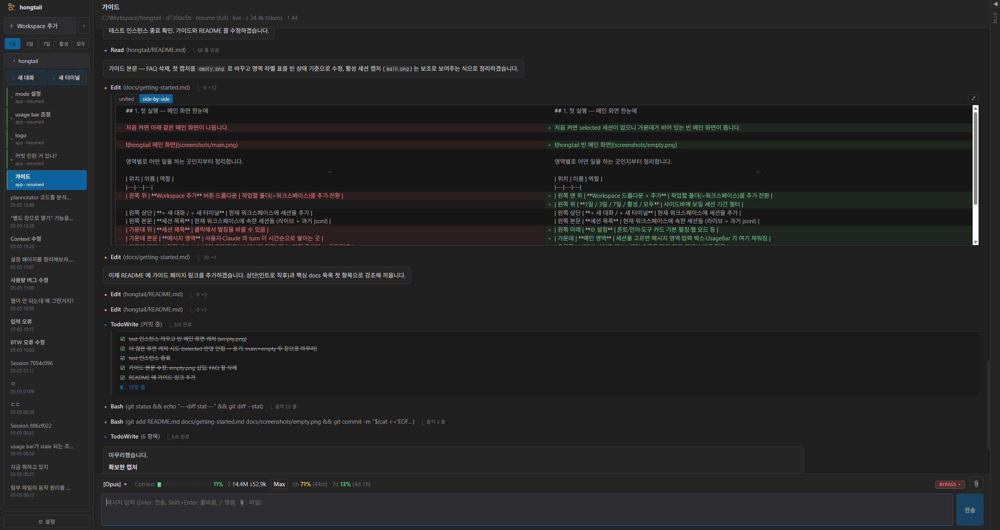

# hongtail

Claude Code CLI 를 데스크톱에서 챗 UI 로 감싼 Electron 앱 (React + TypeScript).
한 워크스페이스 안에 여러 Claude 세션·BTW 사이드 챗·터미널을 띄워 쓰는 게 목적.
v0.1.6+ 부터는 외부 브라우저/모바일에서도 같은 UI 로 접속 가능 (web 모드).



> 처음 쓰시는 분은 [**docs/getting-started.md**](./docs/getting-started.md) —
> 설치·첫 대화·다중 세션·BTW·웹 모드까지 한 페이지로 정리한 한국어 풀 가이드.

## 플랫폼

**Windows 만 테스트됨**. `npm run build:mac` / `build:linux` 빌드 스크립트는 boilerplate 로 남아 있지만 **실제 동작 / 사용성 검증 안 됨** — 사용 시 자신의 책임.

## Project Setup

### Install

```bash
npm install
```

### Development

```bash
npm run dev              # electron-vite dev (HMR)
npm run typecheck        # node + web 둘 다
npm run lint             # eslint
```

### Build (Windows)

```bash
npm run build:win:portable    # 단일 .exe (dist/hongtail-X.Y.Z-portable.exe)
npm run build:win:setup       # NSIS installer
npm run build:win:all         # 둘 다
```

빌드 결과는 `dist/` 에. portable 은 단일 실행 파일이라 설치 없이 바로 실행 가능.

## 핵심 기능

- 백엔드 3종: stream-json (`app`), 터미널 PTY (`terminal`), PTY+jsonl tail (`interactive`)
- 워크스페이스 단위 세션 관리, 별칭, MRU Ctrl+Tab cycling
- BTW 사이드 챗 — 본 대화 옆에서 quick lookup (현재 conversation 컨텍스트 그대로)
- 검색 (Ctrl+F), 슬래시 명령 자동완성, plan mode UI
- 외부 브라우저/모바일 접속 (`docs/web-mode.md`) — 비밀번호 인증 + 선택적 HTTPS

## 외부 통합 (선택)

- **[claude-hud](https://github.com/jarrodwatts/claude-hud)** — usage bar 의
  `5h` / `7d` 한도 셀은 이 플러그인이 `~/.claude/plugins/claude-hud/.usage-cache.json`
  에 쓰는 캐시를 읽음. 없으면 해당 셀만 자동으로 안 보이고 나머지 (모델 / Context % /
  세션 누적 토큰 / 권한 모드) 는 정상. Claude Code CLI 의 `/plugins` 로 설치.

## 핵심 docs

처음 쓰시는 분은 [`docs/getting-started.md`](./docs/getting-started.md).
자세한 내부 동작은 `docs/`:

- `docs/sendinput-flow.md` — stream-json 채널 / control_request / 인터럽트
- `docs/interactive-jsonl-tail.md` — 인터랙티브 백엔드 (jsonl tail)
- `docs/remote-control.md` — 모바일 Claude 앱과의 호환성
- `docs/web-mode.md` — 외부 브라우저/모바일 접속
- `docs/btw-side-chat.md` — BTW 사이드 챗 구조
- `docs/find.md`, `docs/session-aliases.md`, `docs/cli-resume.md` 등

프로젝트 인덱스는 [`CLAUDE.md`](./CLAUDE.md).

## Acknowledgements

hongtail 의 구현 과정에서 다음 두 프로젝트를 참고했습니다.

- **[plannotator](https://github.com/backnotprop/plannotator)** — Claude Code
  플러그인. `PermissionRequest` / `ExitPlanMode` hook 의 stdin/stdout 포맷을
  plannotator 의 hook 코드에서 확인해, hongtail 의 host-confirm UI
  (Plan mode · AskUserQuestion 카드) 구현 기준으로 삼음. 자세히는
  [`docs/host-confirm-ui-plan.md`](./docs/host-confirm-ui-plan.md) §8.4.
- **[claude-hud](https://github.com/jarrodwatts/claude-hud)** — Claude Code
  플러그인. UsageBar 의 `5h` / `7d` rate-limit 셀이 claude-hud 가 기록하는
  `~/.claude/plugins/claude-hud/.usage-cache.json` 캐시 포맷·필드를 그대로
  읽음. 통합 사용 방식은 위 "외부 통합" 섹션 참조.

## Recommended IDE Setup

[VSCode](https://code.visualstudio.com/) + [ESLint](https://marketplace.visualstudio.com/items?itemName=dbaeumer.vscode-eslint) + [Prettier](https://marketplace.visualstudio.com/items?itemName=esbenp.prettier-vscode)
